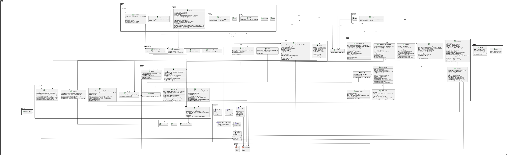

# NuChat

NuChat is an instant messaging app (similar to WhatsApp) built with [Nuxt 3](https://nuxt.com/) and [Supabase](https://supabase.com/).

You can find a further explanation of every part of the project in the following links:

-   [Nginx Reverse Proxy](./apps/nginx_reverse_proxy/README.md)
-   [SonarQube](./apps/nginx_reverse_proxy/README.md)
-   [Supabase](./apps/supabase/README.md)
-   [Frontend with Nuxt 3](./apps/web/README.md)

---

## Installation

This project uses [Turborepo](https://turbo.build/repo), so to install all dependencies from every part of the project you just need to run the following command:

```bash
npm install # or "npm i"
```

After that, you just need to run the next command to start the whole app:

```bash
npm run dev
```

> **Note**: Since Turborepo works with _npm monorepos_, running the previous commands in the project root will execute the exact same command in each folders inside `apps` directory (sub-project). You can also run the command you want inside each sub-project to avoid executing them globally.

### Port List

These are the ports where each sub-project is expose **locally**:

-   Web (Nuxt): `3000`
-   Supabase (Studio): `3100`
-   Supabase (API): `3200`
-   SonarQube: `3300`

---

## Screenshots

### Landing Page


### Sign In Form


### Main View


### Profile


### Admin Panel


---

## Low-Fi Prototypes

### Landing Page


### Sign In Form


### Main View


### Profile


### Admin Panel


## UML

### Use cases

#### Landing Page


#### Sign In Page


#### Chats Page


### Database

Since Supabase provide a lot of pre-made tables in their database, I'm going to represent only the ones that I create for this project but there are more under the hood.


### Web Class Diagram

